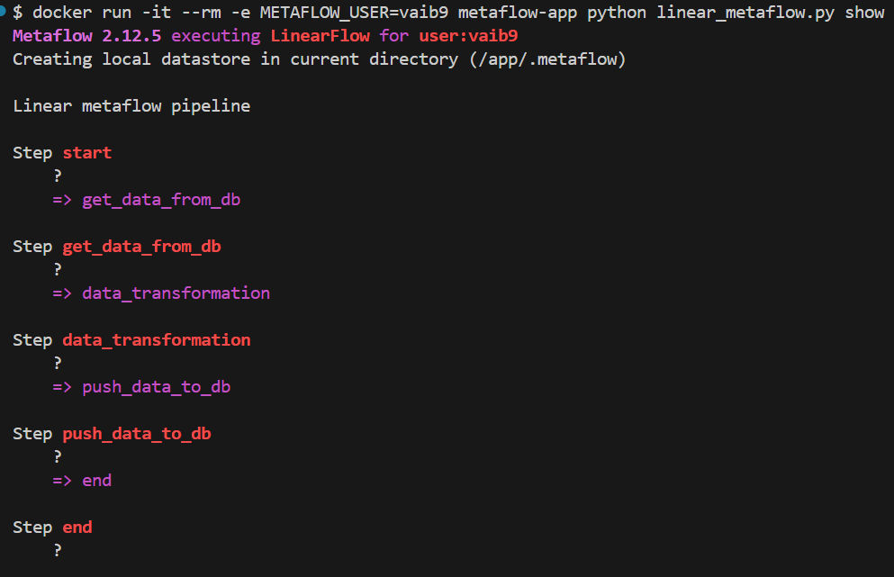

Prerequisite

For initial load of csv file to postgres database
python run load_data.py 

Metaflow DAG overview
start --> get_data_from_db --> data_transformation --> push_data_to_db --> end

Build and run Docker Image

1) docker build -t metaflow-app .
2) docker run -it --rm -e METAFLOW_USER=ai_planet metaflow-app python linear_flow.py show

3) docker run -it --rm -e METAFLOW_USER=ai_planet metaflow-app python linear_flow.py run

Future Improvements for a Fault-Tolerant Pipeline

-   Issue Handling: Address a variety of potential problems such as data source unavailability, 
    data corruption, data processing errors, and delivery issues caused by network or 
    authentication failures.
-   Fault-Tolerant Frameworks: Integrate frameworks that provide fault detection, recovery, 
    reprocessing, checkpointing, and monitoring capabilities.
-   Idempotence: Ensure that the pipeline produces consistent results regardless of how many 
    times it is run, preventing duplicate or inconsistent data.
-   Retry Strategy: Implement a strategy to automatically retry failed operations until they 
    succeed, mitigating transient failures.
-   Backups: Regularly create and store copies of data or system components to restore the 
    system to a previous state or switch to an alternative mode in case of failures.
